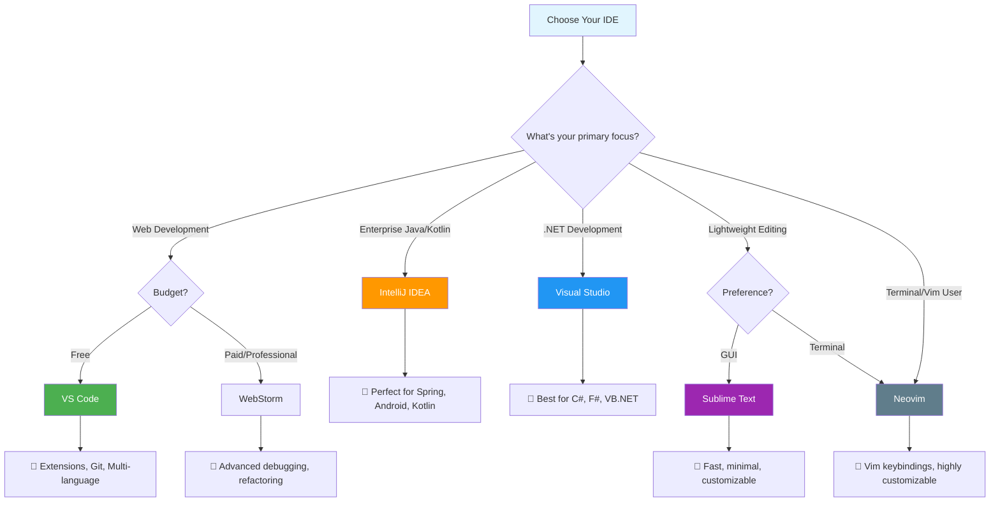

# 🚀 Awesome IDE Tools

A curated list of the top 5 IDEs for developers with detailed comparisons, features, and recommendations to help you choose the perfect development environment.

## 📊 IDE Selection Flowchart

## 🏆 Top 5 IDEs Overview

| IDE | Price | Platform | Best For | Rating |
|-----|--------|----------|----------|---------|
| VS Code | Free | Cross-platform | Web Dev, General | ⭐⭐⭐⭐⭐ |
| IntelliJ IDEA | Free/Paid | Cross-platform | Java, Kotlin | ⭐⭐⭐⭐⭐ |
| Visual Studio | Free/Paid | Windows, Mac | .NET Development | ⭐⭐⭐⭐⭐ |
| Sublime Text | $99 | Cross-platform | Quick Editing | ⭐⭐⭐⭐☆ |
| Neovim | Free | Cross-platform | Terminal-based | ⭐⭐⭐⭐☆ |

## 🔥 Detailed IDE Breakdown

### 1. 📘 Visual Studio Code
**Developer:** Microsoft  
**License:** MIT (Open Source)  
**Price:** Free

**Key Features:**
- 🌐 Extensive extension marketplace (50,000+ extensions)
- 🔧 Integrated Git support
- 🐛 Built-in debugging capabilities
- 📁 Multi-root workspaces
- 🎨 Customizable themes and layouts
- 🔌 Live Share for real-time collaboration

**Supported Languages:**
JavaScript, TypeScript, Python, Java, C++, Go, Rust, PHP, and many more

**Pros:**
- Completely free and open-source
- Huge community and ecosystem
- Lightweight yet powerful
- Cross-platform compatibility
- Regular updates and improvements

**Cons:**
- Can become resource-heavy with many extensions
- Limited advanced refactoring compared to full IDEs

---

### 2. ☕ IntelliJ IDEA
**Developer:** JetBrains  
**License:** Proprietary  
**Price:** Free (Community) / $599/year (Ultimate)

**Key Features:**
- 🧠 Intelligent code completion and analysis
- 🔧 Advanced refactoring tools
- 🐛 Powerful debugging and profiling
- 🗄️ Database tools integration
- 🌐 Built-in version control systems
- 🔍 Deep code inspection and error detection

**Supported Languages:**
Java, Kotlin, Scala, Groovy, and JVM languages

**Pros:**
- Industry-leading Java development environment
- Excellent code analysis and suggestions
- Comprehensive enterprise features
- Outstanding debugging capabilities
- Great framework support (Spring, Hibernate, etc.)

**Cons:**
- Can be resource-intensive
- Steep learning curve for beginners
- Premium features require paid license

---

### 3. 🏢 Visual Studio
**Developer:** Microsoft  
**License:** Proprietary  
**Price:** Free (Community) / $45-250/month (Professional/Enterprise)

**Key Features:**
- 🎯 Excellent .NET ecosystem integration
- 🐛 World-class debugging and profiling tools
- 🔧 IntelliSense code completion
- 🏗️ Integrated build and deployment tools
- 🧪 Comprehensive testing framework support
- ☁️ Azure integration

**Supported Languages:**
C#, VB.NET, F#, C++, Python, JavaScript, TypeScript

**Pros:**
- Best-in-class for .NET development
- Exceptional debugging experience
- Rich ecosystem and templates
- Strong enterprise support
- Integrated Azure tools

**Cons:**
- Primarily Windows-focused (though Mac version available)
- Can be heavyweight for simple projects
- Premium features require subscription

---

### 4. ⚡ Sublime Text
**Developer:** Sublime HQ  
**License:** Proprietary  
**Price:** $99 (one-time purchase)

**Key Features:**
- 🚀 Lightning-fast performance
- 🔍 Powerful search and replace (regex support)
- 📝 Multiple selections and cursors
- 🎨 Highly customizable interface
- 📦 Package ecosystem
- 💾 Minimal resource usage

**Supported Languages:**
Universal syntax highlighting for 40+ languages

**Pros:**
- Extremely fast and responsive
- Clean, distraction-free interface
- Excellent for large files
- Cross-platform consistency
- One-time purchase model

**Cons:**
- Limited built-in features compared to full IDEs
- No integrated debugging
- Fewer collaborative features
- Package management can be complex

---

### 5. 🛠️ Neovim
**Developer:** Neovim Community  
**License:** Apache 2.0 / Vim License  
**Price:** Free (Open Source)

**Key Features:**
- ⚡ Asynchronous job control
- 🔌 Lua scripting support
- 🎯 Modal editing (Vim keybindings)
- 🧩 Extensive plugin ecosystem
- 🖥️ Terminal-based interface
- 🔧 Highly customizable and extensible

**Supported Languages:**
Universal through plugins (LSP support)

**Pros:**
- Extremely lightweight and fast
- Unparalleled customization options
- Great for terminal workflows
- Strong community and plugin ecosystem
- Excellent for remote development

**Cons:**
- Steep learning curve (Vim keybindings)
- Requires significant configuration
- Not beginner-friendly
- Terminal-only interface

## 🎯 Quick Recommendations

### 🌟 For Beginners
**VS Code** - Easy to learn, great documentation, huge community support

### 🏢 For Enterprise Java Development  
**IntelliJ IDEA Ultimate** - Unmatched Java tooling and framework support

### 🔷 For .NET Development
**Visual Studio** - Native Microsoft support and comprehensive .NET ecosystem

### ⚡ For Quick Editing & Performance
**Sublime Text** - Fast, lightweight, great for editing large files

### 🤖 For Terminal Power Users
**Neovim** - Ultimate customization and efficiency for Vim users

## 📈 Market Share & Popularity

Based on Stack Overflow Developer Survey 2024:
1. **VS Code** - 73.7% of developers
2. **Visual Studio** - 32.4% of developers  
3. **IntelliJ IDEA** - 27.9% of developers
4. **Sublime Text** - 15.1% of developers
5. **Neovim** - 8.9% of developers

## 🔗 Useful Links

- [VS Code](https://code.visualstudio.com/)
- [IntelliJ IDEA](https://www.jetbrains.com/idea/)
- [Visual Studio](https://visualstudio.microsoft.com/)
- [Sublime Text](https://www.sublimetext.com/)
- [Neovim](https://neovim.io/)

## 🤝 Contributing

Feel free to contribute to this list by:
- Adding new IDEs
- Updating existing information
- Improving the documentation
- Sharing your experiences

## 📄 License

This project is licensed under the MIT License - see the [LICENSE](LICENSE) file for details.

---

⭐ **Star this repository if you found it helpful!** ⭐

*Last updated: July 2025*